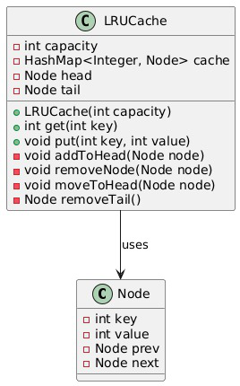

# DSA - LRU Cache

This project demonstrates the implementation of an **LRU (Least Recently Used) Cache**
using **HashMap** and **Doubly Linked List**.

## Features
- O(1) get and put operations
- Efficient cache eviction
- Clean and well-documented code

## Technologies
- Java
- Data Structures (HashMap, Doubly Linked List)

## How It Works
- HashMap provides fast access to nodes
- Doubly Linked List maintains usage order
- Most Recently Used → Head
- Least Recently Used → Tail

## How to Run
1. Compile all Java files
2. Run `Main.java`

## UML Diagram

## Author
Adifa Saniya
